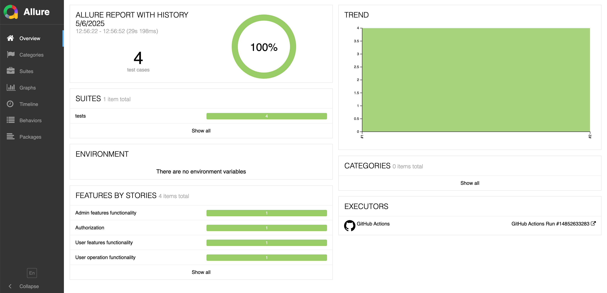
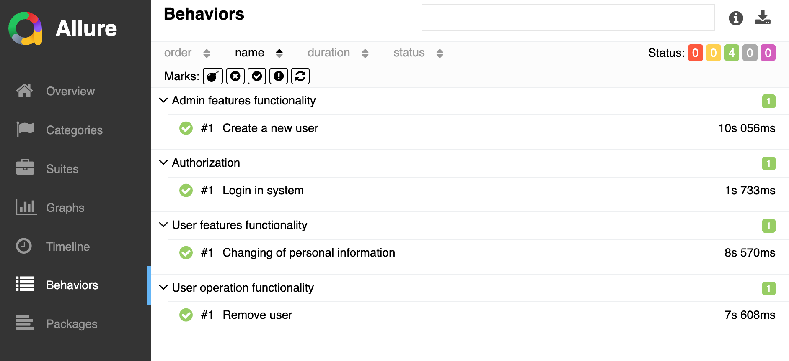
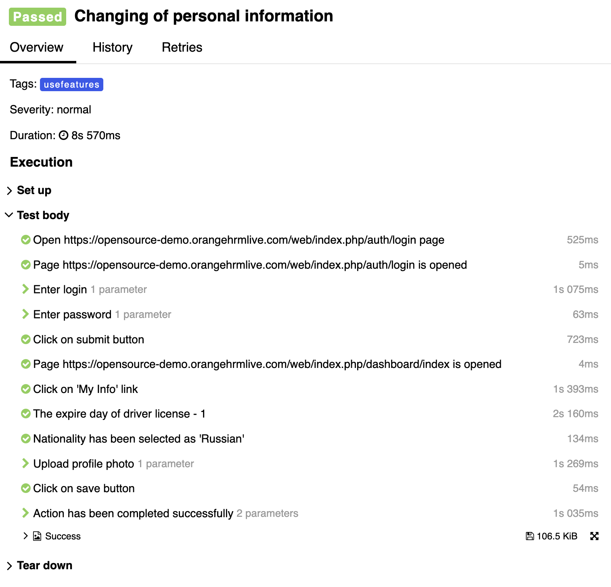

# 
Project of automation UI testing of open source management system for HR specialists :tangerine:range HRM

## :feet: Contents
+ [Project goal](#dart-project-goal)
+ [Technologies and tools](#gear-technologies-and-tools)
+ [List of implemented tests](#white_check_mark-list-of-implemented-tests)
+ [GitHub Actions CI](#rocket-github-actions-ci)
+ [Test results in Allure Report](#bar_chart-test-results-in-allure-report)
+ [Example of passing the test](#eyes-example-of-passing-the-test)

# :dart: Project goal
Testing basic system functions such as authorization, adding a new user, changing profile information and deleting a user from the system

# :gear: Technologies and tools

# :white_check_mark: List of implemented tests
+ User authorization in the system
+ Adding a new user
+ Changing the user's personal information
+ Deleting a previously created user

# :rocket: GitHub Actions CI
Tests are launched using GitHub Actions. The trigger for launching is workflow dispatch

# :bar_chart: Test results in Allure Report
Allure report with the history of previous launches is automatically generated after passing the tests

Result of running tests

List of the tests

Passing the test

# :eyes: Example of passing the test
